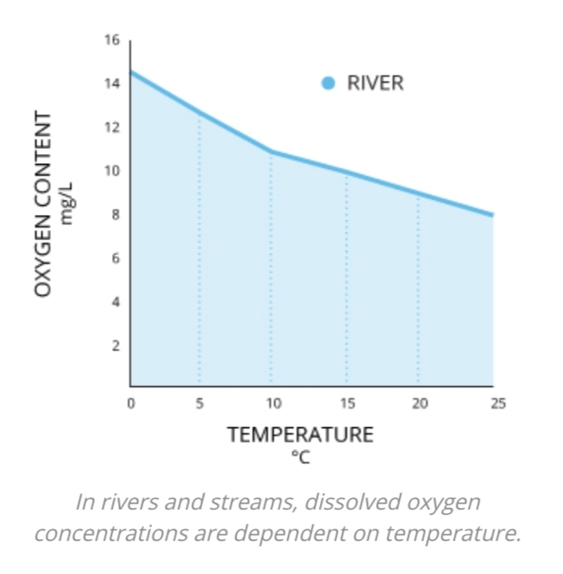

# ESW PROJECT

## Project title:  Innovative Aquatic Cultivation

## Problem statement:

The irregular provision of food to fish often results in instances of overfeeding or underfeeding, subsequently leading to diseases. The release of ammonia into the water necessitates manual intervention for feeding. In the context of cultivating fish within a closed container, it becomes imperative to monitor dissolved oxygen levels at regular intervals. The consistent growth of bacteria, coupled with fluctuations in pH levels, contributes to diminished fish productivity. Furthermore, factors such as temperature and light play significant roles in fish production. Instances of changing water composition also pose threats to the survival of the fish population.


## Solution:

Our proposed solution revolves around the implementation of an automated fish feeding system, aimed at addressing the issues of overfeeding, nitrogen release, and the elimination of manual intervention. We intend to measure the dissolved oxygen content, and if it falls below a predetermined threshold, we will employ natural aeration methods to enhance the oxygen concentration in the water. Additionally, we will monitor various parameters such as pH, Total Dissolved Solids (TDS), and temperature readings to assess the stress levels experienced by the fish population due to environmental factors.  As an optional feature, we are considering the incorporation of a robotic arm to extend the lifespan of the water sensors.

By undertaking these initiatives, we aim to revolutionize aquaculture practices, ensuring optimal fish health, growth, and productivity.


## ThingSpeak creditionals
```
Username: hemanthkumarreddysunkireddy51@gmail.com
password: Iiits@123$
```

## Presentatation
```
https://www.canva.com/design/DAFwGi38-_A/lzGJ421ybFxFqyTZbmun0g/edit?utm_content=DAFwGi38-_A&utm_campaign=designshare&utm_medium=link2&utm_source=sharebutton
```
## Live website deployed at
```
https://hemanth-sunkireddy.github.io/ESW_Project/
```


## Dissolved Oxygen
1. pH is inversely proportional to the dissolved oxygen.
2. Temp is inversely proportional to the dissolved oxygen.
3. normal values for DO is 10-20 mg/L
4. Dissolved oxygen measure decreases in increase of fish count.
5. Suppose we increase fishes. that means they respire more O_2.
6. So we need to increase oxygen supply by turning ON the water fountain



```
Dissolved Oxygen = (70 / (77 - pH)) * (-0.16) * temp + 12.26 
```

reference : 
[https://www.fondriest.com/environmental-measurements/parameters/water-quality/dissolved-oxygen/]


## pH

1. pH is directly propoertional to the Fish count.
2. Suppose fish count is more, it means that fish releases more ammonia in water.
3. Thus basicity of the liquid increases veryu slightly.
4. Amongst the species of fish, breeding occurs only within a specific pH range.
5. aquatic survival range is 5.5 to 8.5

## turbidity 

## temperature

